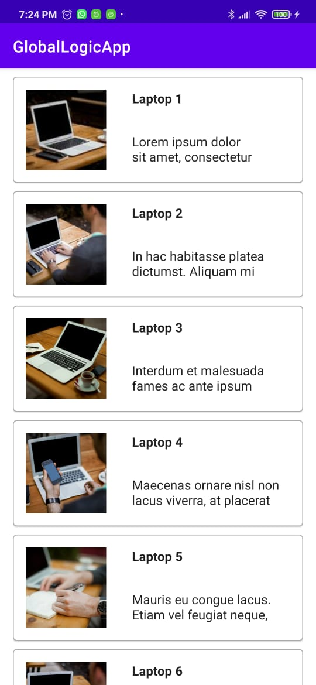
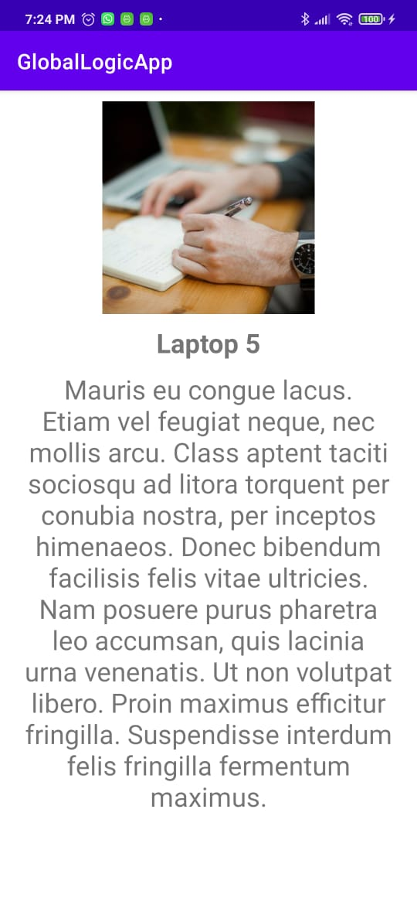

# GlobalLogicApp
Éste es el proyecto prueba de Global Logic, con esta app se puede ver un listado de productos y acceder para ver sus detalles.

# Experiencia de usuario
Este proyecto contiene las siguientes características:

* La pantalla principal donde se ve un listado de productos
* Una vista con un producto específico con su descipción completa (se accede seleccionado un producto del listado de la primer pantalla)

# Capturas de pantalla

  
  

## Guía de implementación

### Trabajo con una API externa que me devuelve los productos, la url es http://private-f0eea-mobilegllatam.apiary-mock.com/list

### Arquitectura

Este proyecto implementa el patrón de arquitectura MVVM y sigue buenas prácticas de Clean Architecture para hacer un código más independiente, mantenible y sencillo.

#### Capas

* UI: Fragments y Activities
* Data: contiene la implementación del repositorio y el source donde se conecta con la api
* Domain: contiene los casos de uso y la definición del repositorio

Este proyecto usa ViewModel para almacenar y manejar datos, así como comunicar cambios hacia la vista.

### Administrador de solicitudes: Retrofit

Este proyecto utiliza Retrofit para mostrar los productos desde una API.

### Inyección de dependencia - Koin

Este proyecto utiliza Koin para gestionar la inyección de dependencia.

# Guía de instalación
En caso de no tener instalado Android Studio, descargue la última versión estable.
Una vez que tenemos el programa instalado vamos a Get from Version Control y vamos a pegar https://github.com/axel-sanchez/GlobalLogicApp.git
Una vez hecho eso se va a clonar el proyecto, lo que resta sería conectar un celular y darle al botón verde de Run 'app'
